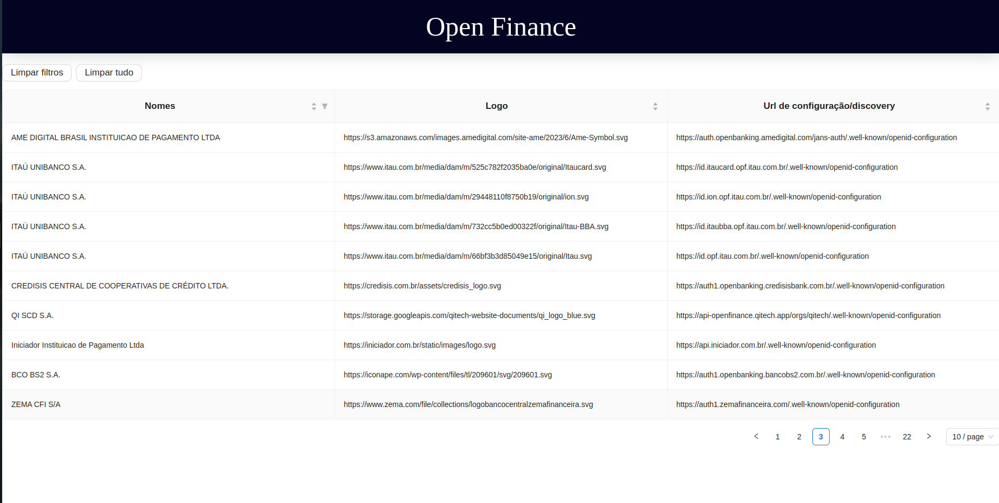

# Open Finance - Teros
_This project consists of implementing an Open finance system, which consists of taking the information from open banking brazil, listing them with some informations and updating them every hour._

<table>
  <tr>
    <td align="center">
      
      <br />
      Home page
    </td>
  </tr>
</table>

## Why
Open Finance, also known as Open Banking, is an initiative by the Central Bank of Brazil aimed at bringing innovation to the financial system, fostering competition, and enhancing the range of products available to consumers.

For this to happen, it's essential that financial institutions participating in Open Finance adapt their platforms and applications to the defined standards.

## About this project
In order for an application from a participating institution to be effectively integrated into the Open Finance ecosystem, it needs to be capable of locating and conducting business flows with platforms and applications from other participating institutions. Therefore, this application is able to obtain information about all Open Banking participating institutions and keep this information up to date, with an API, a database and a web application to visualize data.

# Backend
The highlighted features? It includes:

- **Health** (`/health`) 
  - A route for testing the application's health.

- **Prodcuts** (`/participants`) 
  - Participants update (`/insert`):
    - Participants will be updated every hour, from open banking brazil.

  - List products:
    - All received participants can be viewed.
    

## Technologies
The following badges represent the tools and technologies used in the project:

- [](https://nodejs.org/)

- [](https://expressjs.com/)

- [](https://www.typescriptlang.org/)

- [](https://www.postgresql.org/)

- [](https://www.prisma.io/)

- [](https://jestjs.io/)

- [](https://github.com/visionmedia/supertest)

- [](https://www.docker.com/)
 

## How to run for development

1. Clone this repository
2. Install all dependencies

```bash
$ npm i
```

3. Now you can run through the deploy, the link is further up.

4. Create a PostgreSQL database with whatever name you want

5. Configure the `.env.development` file using the `.env.example` file as a basis

6. Run your database with Prisma:

```bash
# prisma create DB and migrations
$ npm run migration:generate

# prisma deploy
$ npm run migration:run
```

7. Start the server, running in the development environment:

```bash
# build
$ npm run build

# development
$ npm run dev
```

## How to run tests

1. Follow the steps in the last section
2.Configure the `.env.test` file using `.env.example` file as a basis
3. Run your database with prisma:

```bash
# prisma create DB and migrations
$ npm run test:migration:generate

# prisma deploy
$ npm run test:migration:run
```

4. Runing tests:

```bash
# integration tests
$ npm run test

# coverage
$ npm run test:coverage
```

# Frontend
The highlighted features? It includes:

  - **Home** (`/`)
    - Users have the option to view information about all participants and filter or sorter as desired.

## Technologies
The following topics represent the tools and technologies used in the project's construction:

- [](https://reactjs.org/)

- [](https://axios-http.com/)

- [](https://styled-components.com/)

- [](https://reactrouter.com/)

- [](https://vitejs.dev/)

- [](https://www.npmjs.com/package/antd)

- [](https://eslint.org/)

- [](https://www.docker.com/)

## How to run for development

1. Clone this repository
2. Install all dependencies

```bash
npm i
```

3. Populate the `.env` file based on`.env.example`. The `VITE_API_BASE_URL` should follow the instructions provided in the file

4. Running the front-end in a development environment:

```bash
npm run dev
```

### Building and launching for production.

```bash
npm run build
npm preview
```

6. Using the ESLint tool for code formatting:

```bash
#Using the ESLint tool for code linting and error detection
npm run lint

#Using the ESLint tool to fix possible errors
npm run lint:fix
```

## How to run the project with Docker

1. If you don't have Docker installed, you need to install it on your machine first. Visit [docker](https://www.docker.com/) for more information.

### Building the image and running:

2. Everything through the `docker-compose` file, and for this, it is necessary that the `.env.development` file on back-end and the `.env` file on front-end are configured as specified in `.env.example` file and if the mapped ports are available.

3. You must also have a server with a database running, as specified in the `.env.example` file.

4. Run the `docker-compose` file on the main repository file:
```bash
# With logs
docker compose up

# Without logs
docker compose up -d
```

5. The application will be accessible at `http://localhost:8080` in your browser, as per the port mapped in the YAML file.